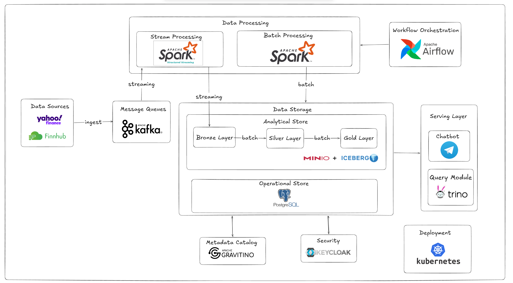
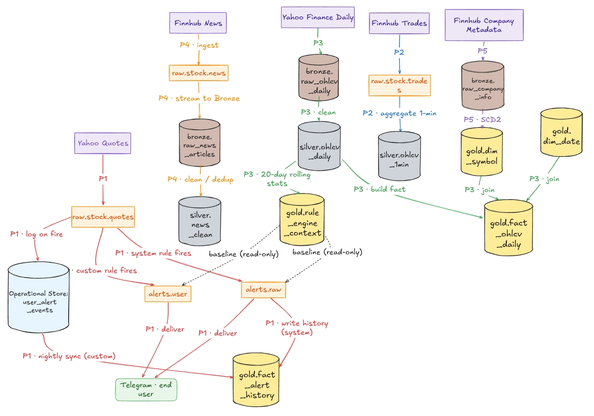

# Stock Anomaly Detection Platform

The platform ingests live market data, detects statistical anomalies in real time,
asks an LLM _"is this move explained by public news?"_, and delivers an instant
Telegram alert with an AI verdict and source links. A lakehouse (Iceberg) records
every event for analytics; a daily Spark batch refreshes the statistical baselines
the rule engine uses.

---

## Table of Contents

- [Key Features](#key-features)
- [Architecture](#architecture)
- [Tech Stack](#tech-stack)
- [Repository Layout](#repository-layout)
- [Detection Pipeline](#detection-pipeline)
- [Data Lakehouse Layers](#data-lakehouse-layers)
- [Kafka Topics](#kafka-topics)
- [Telegram Bot Commands](#telegram-bot-commands)
- [Deployment (Kubernetes)](#deployment-kubernetes)
- [Testing](#testing)
- [Documentation](#documentation)

---

## Key Features

- **Two-layer detection** — fast statistical rules (Layer 0) feed an LLM news-validation
  agent (Layer 1) that classifies each anomaly as `EXPLAINED` / `UNEXPLAINED` / `UNCERTAIN`.
- **Instant context, not just noise** — every alert ships with an AI summary and cited
  news sources, so an investor knows _why_ their stock moved within seconds.
- **Follow-up re-check** — `UNEXPLAINED` anomalies are re-evaluated after a short window;
  if late-breaking news arrives, a follow-up update is sent (verdict flip / confirm).
- **Provider-agnostic LLM** — switch between OpenAI, Gemini, or Claude by changing one
  env var (`LLM_MODEL`), no code change.
- **User-defined custom alerts** — users set their own thresholds via Telegram commands
  (`/setalert AAPL price > 200`).
- **Decoupled & fail-open** — the LLM layer never blocks delivery; on timeout/error the
  alert is forwarded as `UNCERTAIN`. Turn AI on/off by flipping `DELIVERY_SOURCE`.
- **Immutable lakehouse** — Apache Iceberg (Bronze/Silver/Gold) on MinIO, queryable via Trino.

---

## Architecture

### System Architecture



Data Sources (Yahoo Finance, Finnhub) feed Kafka, which fans out to Spark's stream and batch processing. Both land in the Iceberg/MinIO lakehouse (Bronze → Silver → Gold), catalogued by Gravitino and secured by Keycloak, with PostgreSQL as the operational store alongside it. Airflow drives the batch side on a schedule; Trino serves ad-hoc SQL over the lakehouse; the Telegram chatbot is the serving layer's user-facing output. Everything runs on Kubernetes.

### Data Flow



This traces the same system at table/topic granularity — labels `P1`–`P5` correspond to the batch/stream jobs under `spark-application/` (daily OHLCV load, trade-tick aggregation, news ingestion, company-metadata SCD2, and the custom-alert OLTP→OLAP bridge). Two things worth noting from the diagram: `gold.rule_engine_context` and `gold.dim_symbol`/`gold.dim_date` are **read-only baselines** for rule evaluation, never written by the real-time path; and Telegram delivery draws from two separate origins — `alerts.raw`/`alerts.user` (real-time, Kafka) for the message itself, and a nightly sync from `user_alert_events` (PostgreSQL) into `gold.fact_alert_history` (Iceberg) for analytics, not delivery.

Full per-layer detail lives in each area's own README: [`services/README.md`](services/README.md) (microservices) · [`spark-application/README.md`](spark-application/README.md) (batch jobs) · [`infra/k8s/README.md`](infra/k8s/README.md) (cluster infra).

---

## Tech Stack

| Layer          | Technology                                        | Role                                                                |
| -------------- | ------------------------------------------------- | ------------------------------------------------------------------- |
| Streaming      | Apache Kafka                                      | Event backbone — quotes, trades, news, alerts                       |
| Microservices  | FastStream + FastAPI (async Python 3.12)          | Rule engine, LLM agent, alert service, producers, bot               |
| LLM            | LangGraph + `init_chat_model` (provider-agnostic) | News retrieval + anomaly classification                             |
| Batch / Stream | Apache Spark (Scala)                              | Daily rolling stats, tick aggregation, OLTP→Iceberg sync            |
| Lakehouse      | Apache Iceberg + MinIO (S3)                       | Immutable Bronze / Silver / Gold data lake                          |
| Catalog / Auth | Apache Gravitino + Keycloak (OAuth2)              | Iceberg REST catalog with token-based auth                          |
| Query          | Trino                                             | SQL analytics on Iceberg                                            |
| OLTP           | PostgreSQL 15                                     | `users`, `user_alert_rules`, `user_alert_events`, `sync_watermarks` |
| Orchestration  | Apache Airflow                                    | Scheduled Spark batch DAGs                                          |
| Runtime        | Kubernetes                                        | All services + infra run as deployments                             |
| Alerting       | Telegram Bot API                                  | System + custom alert delivery, bot commands                        |
| Data sources   | yfinance, Finnhub, NewsAPI.org                    | Market data and news                                                |

---

## Repository Layout

```
.
├── services/                      # Async Python microservices — see services/README.md
│   ├── rule-engine/               # Layer 0 — 6 statistical rules + custom-rule evaluator
│   ├── llm-agent/                 # Layer 1 — LangGraph news-validation agent
│   ├── alert-service/             # Sole Telegram sender; DLQ; Iceberg history + judgement
│   ├── telegram-bot/              # Bot commands (/setalert, /watch, /systemalerts, ...)
│   ├── yfinance-quotes-producer/  # yfinance → raw.stock.quotes
│   ├── finnhub-trades-producer/   # Finnhub WS → raw.stock.trades
│   ├── finnhub-news-producer/     # Finnhub news → raw.stock.news
│   ├── db/migrations/             # PostgreSQL schema (users, alert rules, watchlist, prefs)
│   ├── shared/                    # Empty — vestigial from before the Telegram-sender
│   │                              # consolidation into alert-service; not otherwise used
│   ├── k8s/                       # Per-service k8s manifests
│   └── scripts/                   # build_and_push / run / stop helpers per service
│                                   # → each of the 7 service dirs above has its own README
│
├── spark-application/             # Apache Spark batch & streaming jobs (Scala) — see
│   │                               # spark-application/README.md
│   ├── ohlcv-daily-loader/        # yfinance OHLCV → bronze
│   ├── news-ingest-stream/        # Finnhub news → bronze (streaming)
│   ├── news-cleaner/              # bronze → silver.normalized.news_clean
│   ├── rule-engine-context-builder/  # 20d rolling stats → gold.rule_engine_context
│   ├── fact-ohlcv-daily-builder/  # gold star-schema fact builder
│   ├── sync-custom-alerts/        # PostgreSQL → gold.fact_alert_history bridge
│   └── ...                        # dim-loader, trades-ohlcv-stream, company-info-loader, etc.
│                                   # → each of the 10 app dirs has its own README
│
├── airflow-dags/                  # Airflow DAGs orchestrating the Spark batch pipeline
└── infra/k8s/                     # Cluster infra: storage, compute, orchestration — see
                                    # infra/k8s/README.md for the full install order
```

---

## Detection Pipeline

### Layer 0 — Rule Engine (real-time)

Consumes `raw.stock.quotes`, loads `gold.rule_engine_context` (20-day baselines) at startup,
and applies **6 rules** per quote (<10 ms target latency):

| Rule               | Trigger                   | HIGH severity |
| ------------------ | ------------------------- | ------------- |
| Price Z-Score      | `\|z_price\| > 3.0`       | `\|z\| > 4.5` |
| Volume Z-Score     | `z_vol > 3.0`             | `z > 5.0`     |
| Volume Ratio       | `vol / avg_vol_20d > 3.5` | —             |
| Bollinger Breakout | `bb_pos > 1.0` or `< 0.0` | —             |
| RSI Extreme        | `RSI > 80` or `< 20`      | —             |
| Intraday Range     | `(high − low) / low > 5%` | —             |

System anomalies → `alerts.raw`. Custom user rules are evaluated in the same path → `alerts.user`.

### Layer 1 — LLM Agent (real-time, LangGraph)

Consumes `alerts.raw`. Graph: `ingest → retrieve_news → classify → route`.

- **retrieve_news** unions two Iceberg catalogs — fresh tail (`bronze.raw.raw_news_articles`)
  and historical body (`silver.normalized.news_clean`) — then dedups to top-K.
- **classify** asks the LLM for a verdict + category + summary, applying a _relevance gate_:
  only news titles actually retrieved may be cited (anti-hallucination).
- **route** publishes a `ConfirmedAlertEvent` to `alerts.confirmed`. `UNEXPLAINED` alerts
  schedule a single re-check that may emit a `FollowUpEvent` on `alerts.followup`.
- **Safety:** TTL fail-open → `UNCERTAIN`, circuit breaker on repeated LLM failures, and
  `alert_id`-based idempotency.

`DELIVERY_SOURCE` on `alert-service` controls which topic drives delivery: `raw` bypasses
the LLM entirely (legacy path, no AI block in the message); `confirmed` — the setting
currently shipped in `k8s/alert-service/deployment.yaml` — routes every alert through this
layer first. Flipping the flag back to `raw` reverts instantly, no other service restart
required.

---

## Data Lakehouse Layers

| Layer      | Examples                                                                                                                                              | Notes                       |
| ---------- | ----------------------------------------------------------------------------------------------------------------------------------------------------- | --------------------------- |
| **Bronze** | `raw.raw_ohlcv_daily`, `raw.raw_news_articles`, `raw.raw_company_info`                                                                                | Raw ingested data (Iceberg) |
| **Silver** | `normalized.ohlcv_daily`, `normalized.ohlcv_1min`, `normalized.news_clean`                                                                            | Cleaned & deduped           |
| **Gold**   | Star schema: `dim_symbol` (SCD2), `dim_date`, `fact_ohlcv_daily`, `fact_alert_history`; operational `rule_engine_context`; opt-in `anomaly_judgement` | Analytics-ready             |

Real-time quotes/trades stay **Kafka-only** (7-day retention — no time-series DB).

---

## Kafka Topics

| Topic              | Producer            | Consumer            | Payload             |
| ------------------ | ------------------- | ------------------- | ------------------- |
| `raw.stock.quotes` | yfinance producer   | rule-engine         | QuoteEvent          |
| `raw.stock.trades` | finnhub trades      | Spark (tick aggr.)  | TradeTick           |
| `raw.stock.news`   | finnhub news        | Spark (news ingest) | NewsArticle         |
| `alerts.raw`       | rule-engine         | llm-agent           | AlertEvent          |
| `alerts.user`      | rule-engine         | alert-service       | CustomAlertEvent    |
| `alerts.confirmed` | llm-agent           | alert-service       | ConfirmedAlertEvent |
| `alerts.followup`  | llm-agent           | alert-service       | FollowUpEvent       |
| `alerts.failed`    | alert-service (DLQ) | operator tooling    | FailedAlertEnvelope |

> The Pydantic model in each service's `schema.py` is the single source of truth for a
> topic's JSON shape; corresponding Spark `StructType`s mirror it exactly.

---

## Telegram Bot Commands

Users manage everything — custom alert rules, symbol watchlist, notification preferences —
via Telegram commands. No new service is added for any of this: the logic lives inside the
existing `rule-engine` and `telegram-bot`. PostgreSQL is the source of truth; Iceberg is the
analytics sink.

**Custom alerts:**

| Command                                                        | Effect                                                                           |
| -------------------------------------------------------------- | -------------------------------------------------------------------------------- |
| `/setalert <SYMBOL\|*> <field> <op> <threshold> [once\|every]` | Create a rule; triggers a `rule-engine` hot reload                               |
| `/listalerts`                                                  | List your rules (active/paused/triggered), indexed for use in the commands below |
| `/pausealert <n>` / `/resumealert <n>` / `/resetalert <n>`     | Change a rule's status                                                           |
| `/delalert <n>`                                                | Delete a rule; triggers a hot reload                                             |
| `/alerthistory [SYMBOL]`                                       | Show fired custom-alert events                                                   |

**Fields:** `price`, `daily_return`, `day_volume`, `volume_zscore`, `volume_ratio_20d`,
`price_zscore`, `rsi_14`, `bb_position` (last two are end-of-previous-day batch values, not
live intraday) · **Operators:** `>` `<` `>=` `<=` `CROSSES_UP` `CROSSES_DOWN`

**Watchlist & preferences:**

| Command                                                | Effect                                            |
| ------------------------------------------------------ | ------------------------------------------------- |
| `/watch <SYMBOL>` / `/unwatch <SYMBOL>` / `/watchlist` | Manage symbols you want system-alert coverage for |
| `/systemalerts <all\|watchlist\|off>`                  | Choose which system anomalies you receive         |
| `/customalerts <on\|off>`                              | Toggle custom-alert delivery                      |
| `/preferences`                                         | Show your current settings                        |
| `/start` / `/help`                                     | Onboarding + full command list                    |

On `/setalert`/`/delalert`: the bot inserts/deletes the PostgreSQL row, then calls
`rule-engine`'s `POST /internal/reload-user-rules`. On any watchlist/preference change: the
bot calls `alert-service`'s `POST /internal/reload-subscribers` instead. Both calls fail soft
— a reload failure is logged, never blocks the command reply, since the mutation is already
durable in Postgres. Full detail: [`services/telegram-bot/README.md`](services/telegram-bot/README.md).

---

## Deployment (Kubernetes)

Deployment happens in layers — cluster infra, then batch/streaming Spark jobs, then the
real-time microservices. Each layer has its own README with the full, authoritative
step-by-step guide; what follows here is the order to read them in and how the layers hand
off to each other. **Don't stop at this section** — open the linked README for whichever
layer you're actually deploying and follow it folder by folder.

### Step 0 — Cluster infra

Everything else assumes PostgreSQL, Kafka, MinIO, Gravitino, and Keycloak are already running
in the `stock-anomaly-detection` namespace. Bootstrap and configure these from scratch by
following, in order:

- [`infra/k8s/README.md`](infra/k8s/README.md) → **Installation Order** — storage layer first
  (PostgreSQL, MinIO, Keycloak, Gravitino), then orchestration (Kafka, Airflow), then compute
  (Spark Operator, Trino).
- [`infra/k8s/README.md`](infra/k8s/README.md) → **Post-Deployment Configuration** — Keycloak
  client setup, Gravitino metalake/catalog registration, MinIO bucket creation. Nothing in the
  layers below will work without this step.

Each infra component (`infra/k8s/storage/`, `orchestration/`, `compute/`) has its own README
one level down with the exact `helm`/`kubectl` commands and a diff against upstream chart
defaults — read those directly if a specific component needs adjusting.

### Step 1 — Database schema and Kafka topics

Both are prerequisites for the services layer (Step 3) and shared across services:

```bash
# DB migrations — see services/README.md#database for what each one adds
kubectl port-forward svc/openhouse-postgresql-primary 5432:5432 -n stock-anomaly-detection &
psql -h localhost -U stock_user -d stock_anomaly -f services/db/migrations/001_initial_schema.sql
psql -h localhost -U stock_user -d stock_anomaly -f services/db/migrations/002_multi_user_routing.sql

# Kafka topics — see services/README.md#kafka-topics for the full 8-topic table
bash infra/k8s/orchestration/scripts/create_kafka_topics_plaintext.sh
```

### Step 2 — Spark batch and streaming jobs

Populates the lakehouse (`gold.rule_engine_context`, `gold.dim_symbol`, etc.) that the
microservices layer depends on before it can evaluate anything meaningfully. Full detail,
per-app build/run commands, and the required run order across all 10 jobs:
[`spark-application/README.md`](spark-application/README.md) → **First-time Startup Order**.
Each app under `spark-application/<name>/` has its own README with pipeline steps, resource
sizing, and known issues.

### Step 3 — Microservices

```bash
# Build & push an image — see the registry warning below first
bash services/scripts/build_and_push-llm-agent.sh v0.5

# Create the required secret (example: llm-agent with OpenAI)
kubectl create secret generic llm-agent-secret -n stock-anomaly-detection \
  --from-literal=OPENAI_API_KEY="sk-..." \
  --from-literal=ICEBERG_OAUTH2_CREDENTIAL="<client_id>:<client_secret>" \
  --from-literal=S3_ACCESS_KEY_ID="..." \
  --from-literal=S3_SECRET_ACCESS_KEY="..."

# Deploy (rollout-status gated)
bash services/scripts/run-llm-agent.sh
bash services/scripts/run-alert-service.sh
```

This repo has 7 services and each needs its own secret before it will start — the full list
of required secrets (which keys, which service) is in
[`services/README.md#prerequisites`](services/README.md#prerequisites). The dependency order
to deploy them in (producers → `rule-engine` → `llm-agent` → `alert-service` → `telegram-bot`,
and why) is in [`services/README.md#first-time-startup-order`](services/README.md#first-time-startup-order).
Each service under `services/<name>/` has its own README with the exact env vars it reads,
resource sizing, and known issues — read that before changing a service's config, since a few
services assemble derived settings (e.g. `pg_dsn`) from several flat env vars at once.

> ⚠️ Every `build_and_push-*.sh` script (in both `services/scripts/` and
> `spark-application/scripts/`) pushes to a hardcoded `hungvt0110` Docker Hub registry — edit
> `REGISTRY` in the script (and the matching `image:` field in its `k8s/*/deployment.yaml` or
> `k8s/*-spark-application.yaml`) before building your own images. See
> [`services/README.md#build-and-push-docker-image`](services/README.md#build-and-push-docker-image)
> and [`spark-application/README.md#build-and-push-docker-image`](spark-application/README.md#build-and-push-docker-image)
> for the exact pre-build steps.

### Step 4 — Toggling the AI layer

`alert-service`'s `DELIVERY_SOURCE` controls whether alerts go through `llm-agent` first. The
manifest in this repo ships with `DELIVERY_SOURCE=confirmed` (AI layer on) already — flip it
to `raw` (and `KAFKA_INPUT_TOPIC=alerts.raw`) to bypass the LLM entirely; revert both to turn
it back on. Either direction is a config-only change, no code or restart of `llm-agent` itself
required. Detail: [`services/alert-service/README.md`](services/alert-service/README.md).

### Step 5 — Telegram webhook

The Telegram bot's **inbound** webhook requires a public HTTPS tunnel (ngrok / Cloudflare
Tunnel) — see [`services/telegram-bot/README.md`](services/telegram-bot/README.md) →
**Prerequisites: Public Webhook Tunnel** for the exact commands. Outbound alert delivery
(Telegram → user) needs **no** tunnel.

---

## Testing

Each Python service uses **pytest** with mocked Kafka/Iceberg/LLM (no live deps required).
Only `llm-agent` declares a `[project.optional-dependencies] test` extra in its
`pyproject.toml` — for `rule-engine`, `alert-service`, and `telegram-bot`, install `pytest`
separately:

```bash
cd services/llm-agent
pip install -e ".[test]"
python -m pytest tests/ -v

cd services/rule-engine   # or alert-service, telegram-bot
pip install -e .
pip install pytest pytest-asyncio pytest-cov
python -m pytest tests/ --cov=src --cov-report=term-missing
```

The 3 data producers (`yfinance-quotes-producer`, `finnhub-trades-producer`,
`finnhub-news-producer`) have **no `tests/` directory today** — see each producer's own
README for what's covered. Test depth otherwise varies: `rule-engine` and `llm-agent` cover
all rule/graph logic; `alert-service` has the deepest suite (consumers, delivery, formatter,
rate limiter, Iceberg writers, DLQ); `telegram-bot`'s suite is thin (`/start`, symbol
validation, watchlist/preference services — no handler-level tests yet). See
[`services/README.md#testing`](services/README.md#testing) for the full per-service breakdown.

---

## Documentation

| Document                                                     | Purpose                                                                         |
| ------------------------------------------------------------ | ------------------------------------------------------------------------------- |
| [`services/README.md`](services/README.md)                   | All 7 microservices — architecture, Kafka contracts, config, secrets, build/run |
| [`spark-application/README.md`](spark-application/README.md) | All 10 Spark jobs — pipeline steps, resource sizing, build/run                  |
| [`infra/k8s/README.md`](infra/k8s/README.md)                 | Cluster bootstrap — storage, compute, orchestration, install order              |

Every service and every Spark app also has its own README one level down
(`services/<name>/README.md`, `spark-application/<name>/README.md`) with full detail —
the top-level READMEs above are indexes into these, not summaries that replace them.

---

> Built as a real-time data-engineering + applied-LLM platform demonstrating streaming
> detection, lakehouse analytics, and decoupled AI enrichment.
