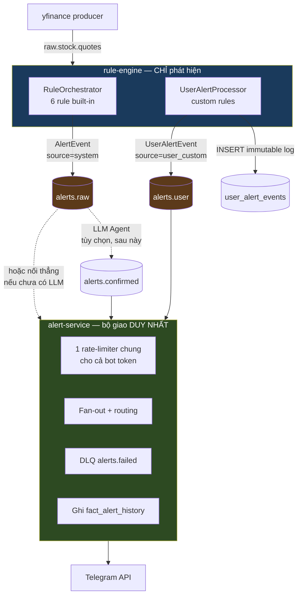

# Architecture Review — Luồng bắn Alert

**Ngày**: 2026-06-02
**Reviewer**: Principal Architect (architecture-designer)
**Scope**: rule-engine, alert-service, telegram-bot; topic `alerts.raw` / `alerts.confirmed`; cả 2 luồng system + custom
**Tài liệu nền**: [alert-flow-current-state.md](./alert-flow-current-state.md), [backend-redesign-plan.md](./backend-redesign-plan.md)
**Câu hỏi cần trả lời**: Thiết kế luồng bắn alert hiện tại đã hợp lý chưa? Có cần sửa gì không?

---

## 1. Phán quyết tổng quan (Executive Verdict)

> **Kết luận ngắn**: Thiết kế **đúng hướng** ở phần delivery của system alert (tách detection ↔ delivery, fan-out, audit-first, DLQ, rate-limit). Nhưng có **1 lỗi chặn (CRITICAL)** khiến system alert không chạy, và **1 bất đối xứng kiến trúc (HIGH)** khiến custom alert đi đường vòng riêng — tạo ra rủi ro thật về rate-limit và nợ kỹ thuật. **Cần sửa**, không nên giữ nguyên.

| Tiêu chí                             | Điểm          | Ghi chú                                                        |
| ------------------------------------ | ------------- | -------------------------------------------------------------- |
| Separation of concerns (system path) | 🟢 Tốt        | rule-engine phát hiện, alert-service giao — ranh giới rõ       |
| Separation of concerns (custom path) | 🔴 Kém        | rule-engine vừa phát hiện vừa **tự gửi Telegram**              |
| Failure handling                     | 🟢 Tốt        | audit-first, DLQ, idempotent producer, cache invalidation đúng |
| Khả năng vận hành (end-to-end)       | 🔴 Hỏng       | system alert **không tới người dùng** (thiếu LLM Agent)        |
| Tính nhất quán giữa 2 luồng          | 🟠 Trung bình | 2 cơ chế giao khác nhau, 2 sink lịch sử khác nhau              |
| Khả năng scale ngang                 | 🟠 Trung bình | state cooldown/prev-value in-memory, single-replica            |
| Rate-limit an toàn (Telegram 429)    | 🟠 Rủi ro     | 2 service chung 1 bot token, ngân sách rate **không phối hợp** |

---

## 2. Kiến trúc as-built (tóm tắt)

Có **2 luồng alert độc lập** (chi tiết + sequence diagram xem [alert-flow-current-state.md](./alert-flow-current-state.md)):

- **Luồng A — Custom alert**: `rule-engine (UserAlertProcessor)` → INSERT `user_alert_events` (PG) → **gửi thẳng Telegram** từ chính rule-engine. Không qua Kafka.
- **Luồng B — System alert**: `rule-engine (RuleOrchestrator)` → `alerts.raw` → **[LLM Agent — CHƯA CÓ]** → `alerts.confirmed` → `alert-service` (fan-out) → Telegram.

---

## 3. Điểm mạnh (giữ nguyên, đừng đập đi)

1. **Tách detection ↔ delivery ở luồng system** — `RuleOrchestrator` chỉ phát hiện và publish; `alert-service` lo toàn bộ giao nhận. Đây là ranh giới đúng.
2. **Audit-trail-first** — [delivery.py:fan_out](../services/alert-service/src/alert_service/delivery.py#L61) ghi `fact_alert_history` **trước** khi gửi Telegram. Mất Telegram vẫn còn dấu vết. Tốt.
3. **SubscriberCache chuẩn** — [subscriber_cache.py](../services/alert-service/src/alert_service/subscriber_cache.py): TTL + in-flight dedup (chống thundering-herd) + invalidation hủy cả future đang bay. Đây là code chất lượng cao, không phải cache ngây thơ.
4. **Rate-limit 2 tầng** — [rate_limiter.py](../services/alert-service/src/alert_service/rate_limiter.py): global + per-chat token bucket, LRU bounded, có buffer chống evict-khi-đang-dùng. Suy nghĩ kỹ.
5. **DLQ idempotent** — [dlq_producer.py](../services/alert-service/src/alert_service/dlq_producer.py): `enable_idempotence=True`, `acks=all`, fire-and-forget không làm sập worker. Đúng bài.
6. **Idempotency key Kafka** = `symbol` → giữ thứ tự per-symbol.

---

## 4. Vấn đề — xếp hạng theo độ nghiêm trọng

### 🔴 CRITICAL-1 — Luồng system alert đứt gãy (thiếu producer cho `alerts.confirmed`)

`rule-engine` publish `alerts.raw`, `alert-service` consume `alerts.confirmed`, **không service nào nối 2 topic**. LLM Agent chưa tồn tại. Hệ quả: **0 system alert tới người dùng**. Đây không phải "thiết kế chưa tối ưu" — đây là **tính năng đang chết**.

**Đánh giá thiết kế**: Việc _thiết kế sẵn_ 2 topic cho kiến trúc 2 lớp là hợp lý (chừa chỗ cho LLM). Nhưng **provision hạ tầng trước khi có consumer** = "premature infrastructure". Topic boundary chỉ có giá trị khi có thứ chèn vào giữa.

### 🟠 HIGH-1 — Bất đối xứng kiến trúc: custom alert tự gửi Telegram từ rule-engine

Đây là vấn đề thiết kế **lớn nhất** đang bị che lấp.

- `rule-engine` ôm **2 trách nhiệm**: phát hiện (đúng) **+ giao nhận Telegram** (sai về SoC) — [telegram.py:send_telegram_custom_alert](../services/rule-engine/src/rule_engine/infrastructure/telegram.py#L98).
- Custom alert **không hưởng** bất kỳ hạ tầng delivery nào của alert-service:
  - ❌ Không qua `PerChatRateLimiter`
  - ❌ Không có DLQ khi Telegram fail (chỉ log rồi bỏ — [telegram.py:121](../services/rule-engine/src/rule_engine/infrastructure/telegram.py#L121))
  - ❌ Không ghi `fact_alert_history` real-time (phải chờ Spark batch 07:30 sync từ `user_alert_events`)
- **Telegram client bị nhân đôi** ở 2 service (đã có shared client nhưng vẫn 2 nơi gọi, 2 cấu hình retry) — đây chính là bug #4 trong backend-redesign-plan.

### 🟠 HIGH-2 — Chung bot token, ngân sách rate-limit KHÔNG phối hợp

Cả `rule-engine` (custom) và `alert-service` (system) gửi qua **cùng 1 bot token**. Telegram giới hạn ~30 msg/s **trên toàn bot**. Nhưng:

- `alert-service` tự giới hạn ở 25/s (tưởng mình là sender duy nhất).
- `rule-engine` custom path **không có rate-limit nào cả**.

→ Khi cả 2 cùng bắn (ví dụ thị trường biến động mạnh: vừa nhiều system alert vừa nhiều custom alert), tổng vượt 30/s → **Telegram 429**, và custom alert bị drop âm thầm (không DLQ). Đây là lỗi production tiềm ẩn, khó debug.

### 🟡 MEDIUM-1 — State dedup nằm in-memory, ràng buộc single-replica

`_last_fired` (cooldown) và `_prev_values` (cho `CROSSES_UP/DOWN`) trong [user_alert_processor.py](../services/rule-engine/src/rule_engine/application/user_alert_processor.py#L40-L44) là **process-local**. Hệ quả:

- Restart rule-engine → mất cooldown (có thể bắn lại trùng) + mất prev-value (CROSSES detection sai 1 nhịp).
- **Không thể scale rule-engine >1 replica** cho custom alert — 2 replica có 2 prev-value khác nhau, cooldown không chia sẻ.

Với quy mô 500 symbol / thesis-grade thì single-replica chấp nhận được, nhưng **phải ghi rõ là ràng buộc thiết kế**, không phải vô tình.

### 🟡 MEDIUM-2 — Hai nguồn sự thật cho lịch sử alert

- System alert → `fact_alert_history` (Iceberg, real-time, do alert-service ghi).
- Custom alert → `user_alert_events` (PG) → Spark sync sang `fact_alert_history` lúc 07:30.

→ `fact_alert_history` trộn ghi real-time và ghi batch trễ ~1 ngày. Query BI trong ngày sẽ thấy system alert nhưng **chưa thấy** custom alert. Cần tài liệu hóa độ trễ này cho người dùng dashboard.

### 🟡 MEDIUM-3 — Custom alert: PG INSERT nằm trên hot path mỗi quote

[main.py:71](../services/rule-engine/src/rule_engine/main.py#L71) `handle_quote` await `_alert_processor.evaluate()`, trong đó khi rule khớp sẽ `await insert_event()` (PG) **trước khi** return. Telegram thì đã offload sang task (tốt), nhưng PG insert thì không. Yêu cầu CLAUDE.md là <10ms/quote — một PG round-trip (~1–5ms) khi nhiều rule khớp đồng thời có thể phá ngân sách này lúc cao điểm.

### 🟢 LOW-1 — `enable_per_user_routing=False` mặc định → custom alert vẫn về admin

Đã biết (bug #1), đang chờ rollout Phase 2. Chỉ nhắc lại để đầy đủ.

---

## 5. Kiến trúc mục tiêu (đề xuất)

### Nguyên tắc: **một con đường giao nhận duy nhất**

`alert-service` nên là **bộ giao nhận Telegram DUY NHẤT**. `rule-engine` quay về **thuần phát hiện** — không httpx, không Telegram client.

**Lợi ích**:

- ✅ Một rate-limiter quản toàn bộ bot token → hết rủi ro 429 do 2 service đua nhau (sửa HIGH-2).
- ✅ Custom alert được hưởng DLQ + audit real-time như system alert (sửa HIGH-1, MEDIUM-2).
- ✅ Telegram client biến mất khỏi rule-engine → hết duplicate (sửa bug #4).
- ✅ rule-engine hot path nhẹ đi: chỉ INSERT + publish, không chờ HTTP.

**Đánh đổi**: custom alert thêm **1 hop Kafka** (~vài ms). Với hệ thống này là không đáng kể, đổi lại tính nhất quán + an toàn rate-limit. Vẫn **không thêm service mới** — đúng ràng buộc CLAUDE.md (chỉ thêm topic + chuyển code delivery từ rule-engine sang alert-service).

---

## 6. ADR — Các quyết định then chốt

### ADR-001: Hợp nhất delivery Telegram về một service

**Status**: Accepted — implemented in commit `feat/unify-alert-delivery-soc` (2026-06-02)

**Context**: Hiện custom alert gửi Telegram trực tiếp từ rule-engine, system alert gửi từ alert-service. Hai service chung bot token nhưng rate-limit độc lập → rủi ro 429. Telegram client bị duplicate.

**Decision**: Chuyển toàn bộ delivery Telegram về `alert-service`. rule-engine publish event (system → `alerts.raw`, custom → topic mới `alerts.user`) thay vì tự gửi.

**Alternatives**:

- _Giữ dual-path, thêm rate-limit vào rule-engine_: vá được HIGH-2 nhưng vẫn duplicate client, vẫn 2 sink lịch sử, 2 rate-limiter phải tự phối hợp (mong manh).
- _Dùng Redis làm rate-limit chung_: giải quyết phối hợp nhưng thêm hạ tầng + vẫn còn duplicate delivery logic.

**Consequences**:

- (+) Một đường giao, một rate-limiter, một DLQ, một audit path.
- (+) rule-engine thuần detection, dễ test, dễ scale phần đọc.
- (−) Custom alert thêm độ trễ 1 hop Kafka.
- (−) Cần thêm routing chat_id trong alert-service cho custom (mang user_id/chat_id trong event).

### ADR-002: Xử lý khoảng trống LLM Agent

**Status**: Accepted — implemented (kafka_input_topic=alerts.raw in alert-service, 2026-06-02)

**Context**: `alerts.confirmed` không có producer vì LLM Agent chưa làm. System alert chết.

**Decision**: Trước mắt **nối thẳng** alert-service vào `alerts.raw` (đổi 1 biến env) để system alert sống lại. Giữ `alerts.confirmed` như "điểm chèn LLM" cho tương lai; khi LLM Agent sẵn sàng thì trỏ alert-service về lại `alerts.confirmed`.

**Alternatives**:

- _Làm LLM Agent ngay_: đúng tầm nhìn V3.3 nhưng tốn nhất, block việc system alert chạy.
- _Bridge service copy raw→confirmed_: thêm service trung gian vô nghĩa nếu không lọc.

**Consequences**:

- (+) System alert chạy ngay với chi phí ~0.
- (−) Tạm thời không có tầng lọc LLM → có thể nhiều false-positive; chấp nhận được vì 6 rule đã có threshold.
- (Lưu ý) Phải tài liệu hóa rằng đây là cấu hình tạm; nếu không, "tạm" sẽ thành "vĩnh viễn".

### ADR-003: Chấp nhận state dedup in-memory + ràng buộc single-replica (tạm thời)

**Status**: Accepted (với điều kiện)

**Context**: Cooldown + prev-value của custom alert nằm in-memory → mất khi restart, không scale ngang.

**Decision**: Giữ in-memory cho quy mô hiện tại (500 symbol, 1 replica), **nhưng ghi rõ ràng buộc** vào CLAUDE.md và deployment (replicas=1, không HPA cho rule-engine).

**Alternatives**:

- _Đẩy cooldown/prev-value vào Redis/PG_: cho phép scale ngang nhưng thêm round-trip + hạ tầng — chưa cần ở quy mô này (tránh over-engineer).

**Consequences**:

- (+) Đơn giản, nhanh.
- (−) Không HA cho custom alert; restart làm reset cooldown. Chấp nhận với cảnh báo rõ ràng.

---

## 7. Kế hoạch hành động (ưu tiên)

| #   | Hành động                                                                             | Mức          | Effort         | Sửa vấn đề                       |
| --- | ------------------------------------------------------------------------------------- | ------------ | -------------- | -------------------------------- |
| 1   | Nối alert-service vào `alerts.raw` (đổi `KAFKA_INPUT_TOPIC`) để system alert sống lại | 🔴 Làm ngay  | XS (1 env var) | CRITICAL-1                       |
| 2   | Ghi tài liệu: cấu hình ở (1) là **tạm**, chỗ chèn LLM giữ nguyên                      | 🔴 Làm ngay  | XS             | CRITICAL-1                       |
| 3   | Thêm rate-limit cho custom-alert path (vá nhanh trước khi hợp nhất)                   | 🟠 Sớm       | S              | HIGH-2                           |
| 4   | (ADR-001) Hợp nhất delivery: rule-engine publish `alerts.user`, alert-service giao    | 🟠 Trung hạn | L              | HIGH-1, HIGH-2, MEDIUM-2, bug #4 |
| 5   | Ghi ràng buộc single-replica của rule-engine vào CLAUDE.md + k8s                      | 🟡 Nên       | XS             | MEDIUM-1                         |
| 6   | Tài liệu hóa độ trễ ~1 ngày của custom alert trong `fact_alert_history`               | 🟡 Nên       | XS             | MEDIUM-2                         |
| 7   | Cân nhắc offload PG insert custom alert khỏi hot path (nếu đo thấy >10ms)             | 🟢 Theo dõi  | M              | MEDIUM-3                         |

> **Lộ trình gọn**: (1)+(2) hôm nay → system alert sống. (3) trong tuần → hết rủi ro 429. (4) là khoản đầu tư kiến trúc lớn nhất, làm khi có thời gian — nó dọn sạch HIGH-1/HIGH-2/MEDIUM-2 và bug #4 cùng lúc.

---

## 8. Đánh giá NFR

| NFR                             | Hiện trạng                          | Mục tiêu          | Khoảng cách    |
| ------------------------------- | ----------------------------------- | ----------------- | -------------- |
| **Availability** (system alert) | 0% (đứt)                            | ~99%              | Cần action #1  |
| **Latency** (rule eval)         | <10ms (nguy cơ MEDIUM-3)            | <10ms/quote       | Theo dõi       |
| **Durability** (audit)          | Tốt cho system, trễ cho custom      | Không mất alert   | action #4/#6   |
| **Scalability** (rule-engine)   | Single-replica only                 | Đủ cho 500 symbol | OK, cần ghi rõ |
| **Resilience** (Telegram fail)  | DLQ cho system, **drop** cho custom | DLQ cho cả 2      | action #3/#4   |
| **Rate-limit safety**           | Rủi ro 429 (chung token)            | Không vượt 30/s   | action #3/#4   |

---

## 9. Trả lời trực tiếp câu hỏi của bạn

> **"Thiết kế đã hợp lý chưa?"**
> Phần **delivery của system alert**: hợp lý, chất lượng cao. Phần **kiến trúc tổng thể 2 luồng**: **chưa** — vì có 1 luồng đang chết và 2 luồng giao nhận theo 2 cơ chế khác nhau.

> **"Có cần sửa không?"**
> **Có, bắt buộc.** Tối thiểu phải làm action #1 (system alert đang không chạy). Nên làm #3 (rủi ro 429 thật). Khoản đầu tư đáng giá nhất về lâu dài là #4 (hợp nhất delivery) — nó là gốc rễ của phần lớn nợ kỹ thuật trong luồng alert.
