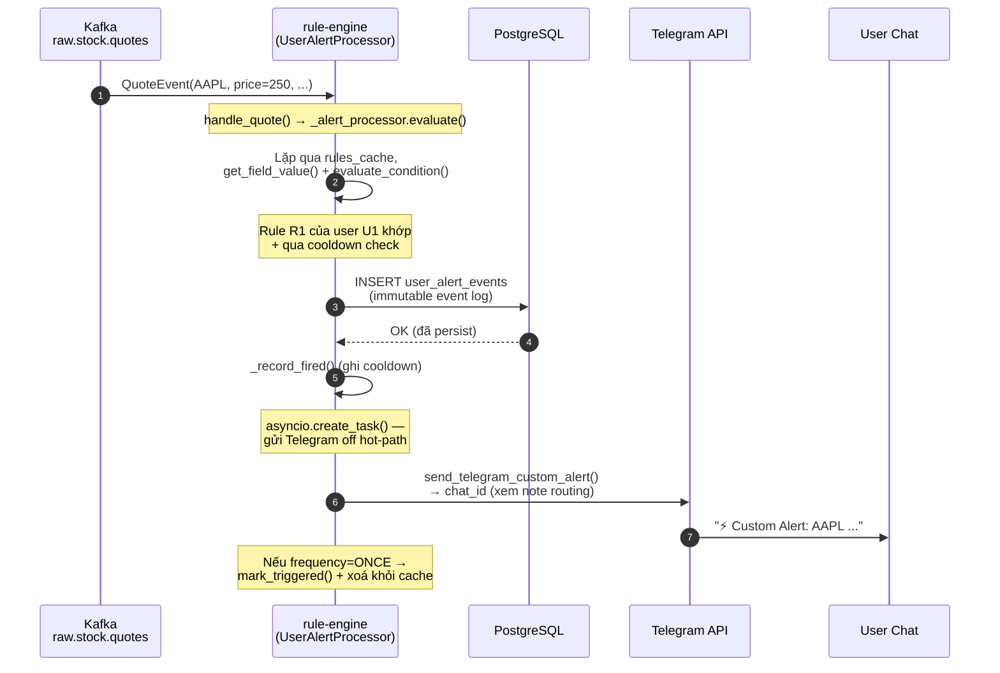
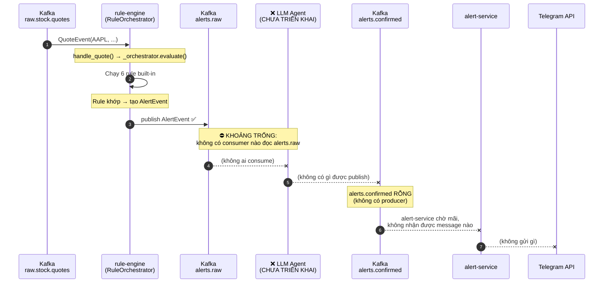
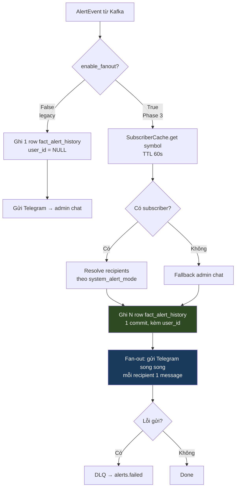
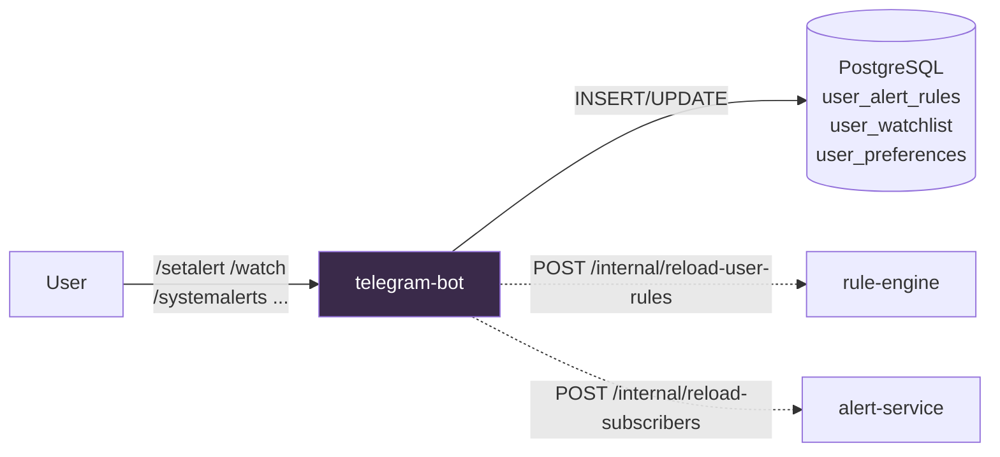
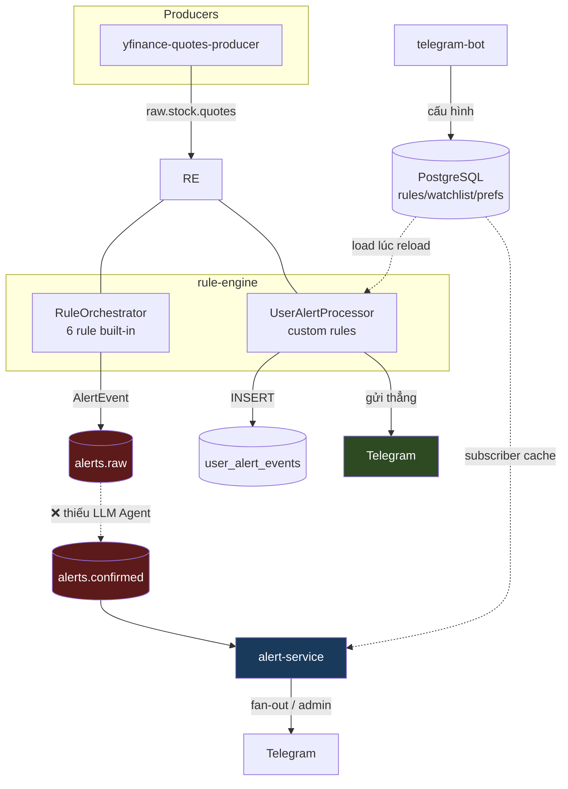

# Alert Flow — Trạng thái hiện tại (chưa có LLM Agent)

**Ngày**: 2026-06-01
**Scope**: rule-engine, alert-service, telegram-bot, Kafka topics `alerts.raw` / `alerts.confirmed`
**Mục đích**: Làm rõ luồng bắn alert **thực tế đang chạy**, đặc biệt là khoảng trống do **LLM Agent chưa được triển khai**.

---

## 1. TL;DR — Đọc cái này trước

Hệ thống hiện có **2 đường alert hoàn toàn độc lập**:

| Đường                    | Đi qua Kafka?         | Trạng thái     | Đích đến                                   |
| ------------------------ | --------------------- | -------------- | ------------------------------------------ |
| **A. Custom user alert** | ❌ KHÔNG              | ✅ HOẠT ĐỘNG   | Telegram (gửi thẳng từ rule-engine)        |
| **B. System rule alert** | ✅ `alerts.raw` → ... | ⚠️ **ĐỨT GÃY** | Mắc kẹt ở `alerts.raw`, không tới Telegram |

> **Điểm mấu chốt**: `alerts.raw` và `alerts.confirmed` được thiết kế cho kiến trúc 2 lớp (rule → LLM validation). Theo thiết kế:
>
> - **rule-engine** publish ra `alerts.raw`
> - **LLM Agent** consume `alerts.raw`, xác thực, rồi publish ra `alerts.confirmed`
> - **alert-service** consume `alerts.confirmed` để gửi Telegram
>
> Nhưng **LLM Agent CHƯA được triển khai** (không tồn tại service nào trong `services/`). Vì vậy `alerts.confirmed` **không có producer** → alert-service không bao giờ nhận được system alert → **system alert hiện không tới được người dùng**.

---

## 2. Bằng chứng trong code

### 2.1 Cấu hình topic (đã verify từ k8s deployment)

| Service       | Input topic             | Output topic                  | File config                                                                                |
| ------------- | ----------------------- | ----------------------------- | ------------------------------------------------------------------------------------------ |
| rule-engine   | `raw.stock.quotes`      | **`alerts.raw`**              | [k8s/rule-engine/deployment.yaml:9-10](../services/k8s/rule-engine/deployment.yaml#L9-L10) |
| alert-service | **`alerts.confirmed`**  | — (gửi Telegram)              | [k8s/alert-service/deployment.yaml:9](../services/k8s/alert-service/deployment.yaml#L9)    |
| LLM Agent     | _(nên là `alerts.raw`)_ | _(nên là `alerts.confirmed`)_ | **❌ KHÔNG TỒN TẠI**                                                                       |

→ Output của rule-engine (`alerts.raw`) **không khớp** với input của alert-service (`alerts.confirmed`). Mắt xích ở giữa bị thiếu.

### 2.2 rule-engine publish ra `alerts.raw`

[rule_engine/main.py:21](../services/rule-engine/src/rule_engine/main.py#L21):

```python
publisher = router.publisher(cfg.kafka_output_topic)  # cfg.kafka_output_topic = "alerts.raw"
```

[rule_engine/application/rule_orchestrator.py:39](../services/rule-engine/src/rule_engine/application/rule_orchestrator.py#L39):

```python
await publisher.publish(alert)   # AlertEvent → alerts.raw
```

### 2.3 alert-service consume `alerts.confirmed`

[alert_service/config.py:10](../services/alert-service/src/alert_service/config.py#L10):

```python
kafka_input_topic: str = "alerts.confirmed"
```

[alert_service/main.py:116](../services/alert-service/src/alert_service/main.py#L116):

```python
@router.subscriber(cfg.kafka_input_topic, group_id=cfg.kafka_consumer_group)
async def handle_alert(event: AlertEvent) -> None: ...
```

### 2.4 Schema 2 đầu KHỚP nhau

`AlertEvent` của alert-service ghi rõ trong docstring: _"Mirror of rule-engine AlertEvent — contract for alerts.raw topic"_ ([schema.py:21](../services/alert-service/src/alert_service/schema.py#L21)). Cả hai có cùng field: `alert_id, symbol, event_ts, rule_name, severity, triggered_value, threshold, context_snapshot`.

→ **Hệ quả quan trọng**: vì schema giống hệt nhau, nếu trỏ alert-service consume thẳng `alerts.raw` thì nó sẽ chạy được ngay mà không cần đổi code (xem §6).

---

## 3. Đường A — Custom User Alert (đang HOẠT ĐỘNG)

Đây là alert do người dùng tự định nghĩa qua lệnh `/setalert`. Nó **không đi qua `alerts.raw`/`alerts.confirmed`** — rule-engine gửi thẳng Telegram.



**Code path**: [main.py:71](../services/rule-engine/src/rule_engine/main.py#L71) → [user_alert_processor.py:\_evaluate_one](../services/rule-engine/src/rule_engine/application/user_alert_processor.py#L87) → [telegram.py:send_telegram_custom_alert](../services/rule-engine/src/rule_engine/infrastructure/telegram.py#L98)

**Routing chat_id** (xem [telegram.py:\_resolve_chat_id](../services/rule-engine/src/rule_engine/infrastructure/telegram.py#L73)):

- `enable_per_user_routing = False` (mặc định) → luôn gửi về admin `telegram_chat_id` ⚠️ (đây là bug #1 trong backend-redesign-plan.md)
- `enable_per_user_routing = True` → gửi về `rule.chat_id` (join từ `users`), fallback admin nếu NULL

> **Lưu ý**: Đường A **immutable-event-first** — ghi `user_alert_events` vào Postgres TRƯỚC, gửi Telegram SAU (fire-and-forget). Nếu Telegram fail, event log vẫn còn → không mất dữ liệu.

---

## 4. Đường B — System Rule Alert (ĐỨT GÃY tại LLM Agent)

Đây là alert từ 6 rule built-in (Price Z-Score, Volume Z-Score, ...). Đây là đường **bị ảnh hưởng** bởi việc thiếu LLM Agent.



**Kết quả thực tế**: AlertEvent từ 6 rule built-in được publish vào `alerts.raw` và **nằm im ở đó** cho tới khi hết retention (7 ngày). alert-service đang lắng nghe `alerts.confirmed` — một topic không ai ghi vào — nên **không có system alert nào tới Telegram**.

### 4.1 Logic bên trong alert-service (sẽ chạy NẾU có message)

Để bạn hình dung khi mắt xích được nối lại, đây là những gì alert-service làm với mỗi `AlertEvent`:



**Bất biến quan trọng** ([delivery.py:fan_out](../services/alert-service/src/alert_service/delivery.py#L61)): ghi Iceberg `fact_alert_history` TRƯỚC (audit-trail-first), gửi Telegram SAU. History fail → abort cả fan-out + DLQ. Telegram fail 1 recipient → DLQ riêng, không ảnh hưởng recipient khác.

---

## 5. Vai trò telegram-bot (KHÔNG nằm trong đường gửi alert)

telegram-bot **không tham gia** việc gửi alert. Nó chỉ xử lý **lệnh người dùng** và ghi cấu hình vào PostgreSQL:



- `/setalert` → ghi `user_alert_rules` → gọi rule-engine reload → từ đó **đường A** mới có rule để bắn.
- `/watch`, `/systemalerts` → ghi `user_watchlist` / `user_preferences` → gọi alert-service reload subscriber cache → ảnh hưởng **đường B** (khi đường B được nối lại).

→ telegram-bot là **control plane** (cấu hình), không phải **data plane** (gửi alert).

---

## 6. Tóm tắt khoảng trống + lựa chọn xử lý

### Vấn đề

System alert (`alerts.raw`) không có đường tới người dùng vì LLM Agent — mắt xích `alerts.raw → alerts.confirmed` — chưa được triển khai.

### Các lựa chọn

| Phương án                    | Việc cần làm                                                                   | Đánh đổi                                                                                                               |
| ---------------------------- | ------------------------------------------------------------------------------ | ---------------------------------------------------------------------------------------------------------------------- |
| **A. Bỏ qua LLM, nối thẳng** | Đổi `KAFKA_INPUT_TOPIC` của alert-service từ `alerts.confirmed` → `alerts.raw` | Nhanh nhất, 0 dòng code (schema đã khớp §2.4). Mất tầng lọc LLM → mọi rule alert đều gửi, có thể nhiều false-positive. |
| **B. Triển khai LLM Agent**  | Viết service mới consume `alerts.raw`, validate, publish `alerts.confirmed`    | Đúng thiết kế V3.3, lọc được nhiễu. Tốn công nhất.                                                                     |
| **C. Bridge tạm**            | Một consumer mỏng copy `alerts.raw` → `alerts.confirmed` không lọc             | Giữ nguyên topic boundary để sau này chèn LLM. Tốn 1 service trung gian.                                               |

> **Khuyến nghị**: Nếu mục tiêu trước mắt là _thấy system alert chạy được_, dùng **phương án A** (chỉ đổi 1 biến env). Khi LLM Agent sẵn sàng, trỏ alert-service trở lại `alerts.confirmed` và bật LLM Agent lên giữa 2 topic.

---

## 7. Sơ đồ tổng thể (kết hợp cả 2 đường)



Đỏ = topic liên quan đến khoảng trống LLM. Đường custom (`UserAlertProcessor → Telegram`) chạy độc lập, không bị ảnh hưởng.
