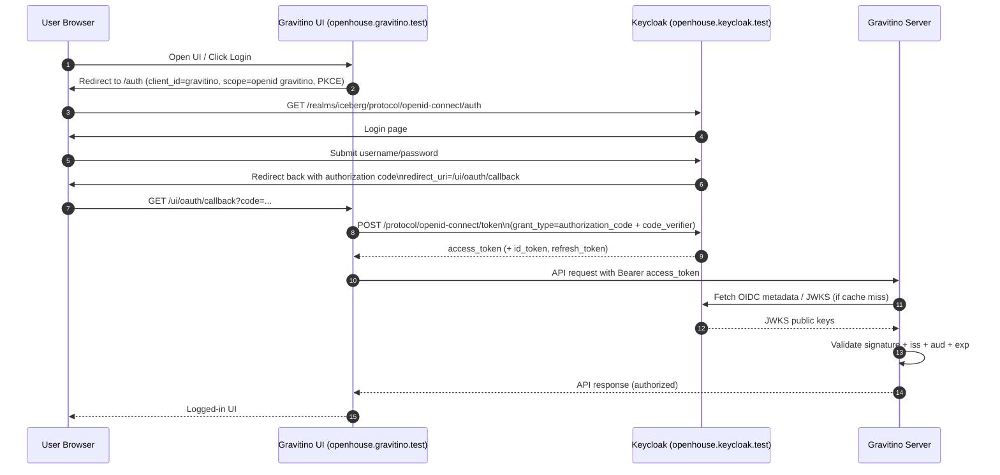

# Gravitino + Keycloak OAuth2 Authentication Flow

Tài liệu này mô tả đầy đủ flow xác thực OAuth2/OIDC giữa Gravitino UI và Keycloak trong môi trường hiện tại, đồng thời giải thích vai trò của các file TLS liên quan.

## 1) Bức tranh tổng quan

- Gravitino UI dùng **Authorization Code Flow + PKCE** (browser-based login).
- Keycloak đóng vai trò **OpenID Provider (IdP)** và phát hành access token.
- Gravitino server validate JWT bằng **JWKS** từ Keycloak.
- Toàn bộ đường đi browser phải chạy HTTPS để tránh lỗi mixed-content/cookie/security.

## 2) Mermaid diagram (OAuth2 flow)

## 3) Điều kiện bắt buộc để flow chạy được

### Keycloak side

- Realm: `iceberg`
- Client: `gravitino` (public client)
  - Standard flow: ON
  - Client authentication: OFF
  - Valid redirect URI phải chứa:
    - `https://openhouse.gravitino.test/ui/oauth/callback`
- Client scope: `gravitino`
  - Có Audience Mapper để đưa `aud=gravitino` vào access token

### Gravitino side

- `authenticators: oauth`
- `authenticator.oauth.provider: oidc`
- `authenticator.oauth.clientId: gravitino`
- `authenticator.oauth.authority: https://openhouse.keycloak.test/realms/iceberg`
- `authenticator.oauth.scope: "openid gravitino"`
- `authenticator.oauth.jwksUri: http://openhouse-keycloak/realms/iceberg/protocol/openid-connect/certs`
- `authenticator.oauth.serviceAudience: gravitino`
- `authenticator.oauth.tokenValidatorClass: org.apache.gravitino.server.authentication.JwksTokenValidator`

## 4) Vai trò của TLS files và secrets trong flow này

## 4.1 TLS cho Keycloak ingress (browser <-> Keycloak)

- File local:
  - `infra/k8s/storage/tls/keycloak_tls.key`
  - `infra/k8s/storage/tls/keycloak_tls.cert`
- Script tạo:
  - `infra/k8s/storage/scripts/create_secret_keycloak_tls.sh`
- K8s secret sinh ra:
  - `keycloak-catalog-tls`
- Vai trò:
  - Cho phép browser truy cập `https://openhouse.keycloak.test/...`
  - Nếu thiếu/không trust được cert, bước redirect login sang Keycloak sẽ fail.

## 4.2 CA cert của Keycloak để Gravitino JVM trust (server-side TLS trust)

- File local dùng làm nguồn:
  - `infra/k8s/storage/tls/keycloak_tls.cert` (cert Keycloak)
- Script tạo secret:
  - `infra/k8s/storage/scripts/create_secret_gravitino_tls.sh`
- K8s secret sinh ra:
  - `keycloak-ca-cert` (chứa `ca.crt`)
- Trong Gravitino pod:
  - Init container `import-keycloak-cert` import cert vào truststore `gravitino.jks`
  - Main JVM chạy với:
    - `-Djavax.net.ssl.trustStore=/opt/gravitino-truststore/gravitino.jks`
- Vai trò:
  - Giúp Gravitino server trust TLS certificate của Keycloak khi cần gọi OIDC endpoints qua HTTPS.

## 4.3 TLS cho Gravitino ingress (browser <-> Gravitino UI)

- File local:
  - `infra/k8s/storage/tls/gravitino_ingress_tls.key`
  - `infra/k8s/storage/tls/gravitino_ingress_tls.cert`
- Script tạo:
  - `infra/k8s/storage/scripts/create_secret_gravitino_tls_ingress.sh`
- K8s secret sinh ra:
  - `gravitino-tls`
- Vai trò:
  - Browser truy cập UI qua `https://openhouse.gravitino.test`
  - Redirect URI trong Keycloak cũng dùng HTTPS; do đó ingress Gravitino cần TLS tương ứng.

## 5) Mapping TLS vào từng chặng request

- Chặng A: Browser -> Gravitino UI (`https://openhouse.gravitino.test`)
  - Dùng cert từ `gravitino-tls`.
- Chặng B: Browser -> Keycloak auth endpoint (`https://openhouse.keycloak.test`)
  - Dùng cert từ `keycloak-catalog-tls`.
- Chặng C: Gravitino server validate token qua JWKS
  - Nếu gọi HTTPS Keycloak thì JVM truststore cần `keycloak-ca-cert`.
  - Nếu gọi internal HTTP (`jwksUri` đang là `http://openhouse-keycloak/...`) thì không dùng TLS ở chặng này.

## 6) Checklist nhanh khi gặp lỗi 400 ở `/auth`

- Client `gravitino` đã tồn tại chưa?
- Redirect URI có đúng 100% với callback không?
- Scope `gravitino` đã tạo và assign cho client chưa?
- Audience Mapper có đưa `aud=gravitino` vào access token chưa?
- Browser có trust cert của `openhouse.keycloak.test` và `openhouse.gravitino.test` không?

