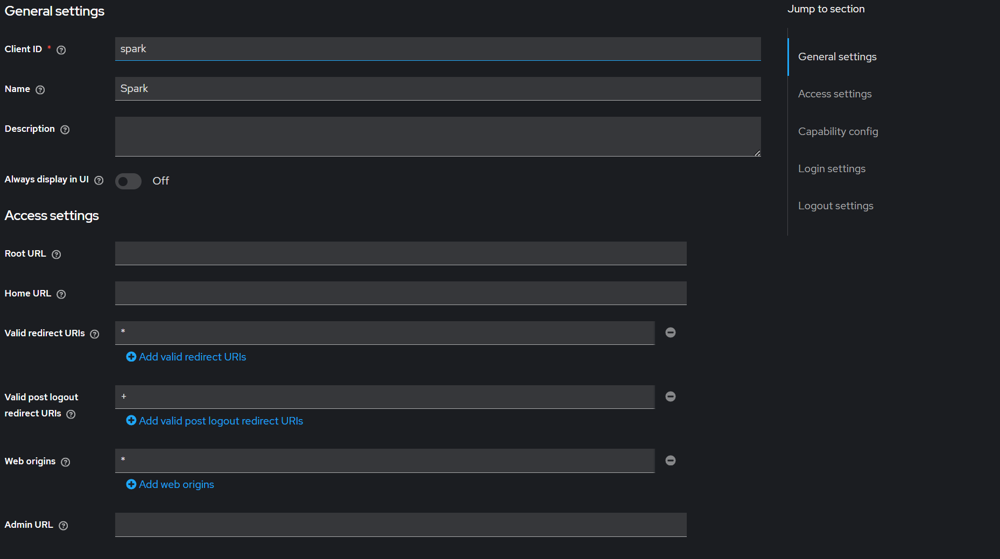
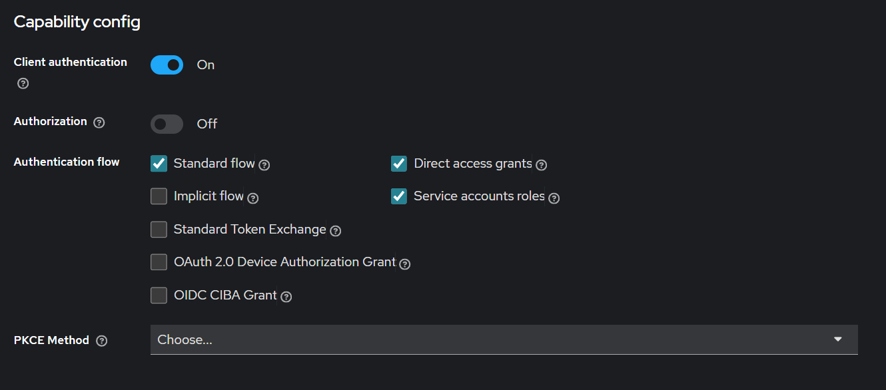
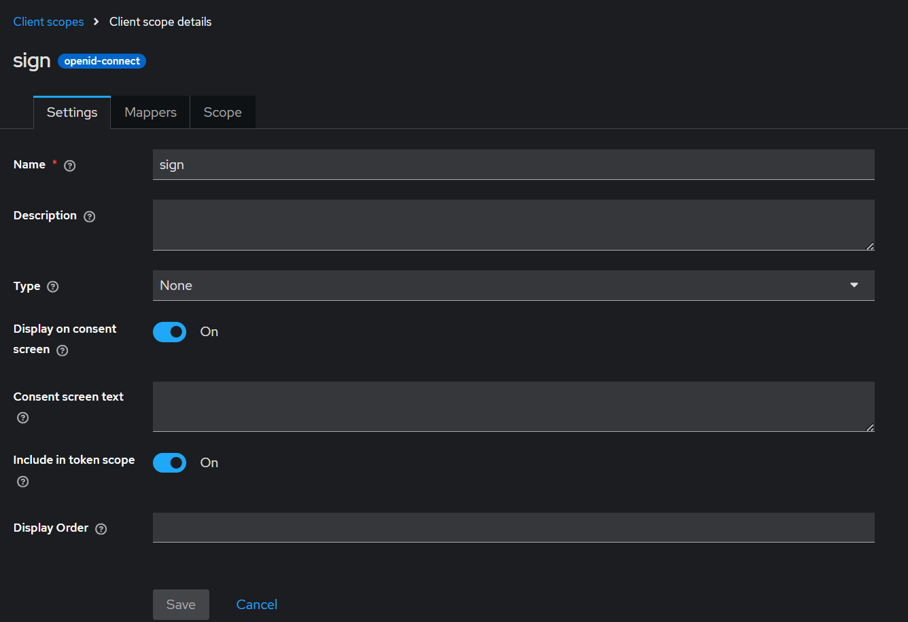

## Storage

Phần storage:

- [minio](#cài-đặt-minio)
- [postgresql](#cài-đặt-postgresql)
- [keycloak](#cài-đặt-keycloak)

### Cài đặt Minio

---

Minio nên cài ngoài bare metal thay vì ảo hóa thêm 1 lớp trên k8s.

- [cài minio trên môi trường enterprise](https://docs.min.io/enterprise/aistor-object-store/installation/linux/install/deploy-aistor-on-ubuntu-server/)
- [cài minio trên môi trường community](https://docs.min.io/community/minio-object-store/operations/deployments/baremetal-deploy-minio-on-ubuntu-linux.html)

Ngoài ra còn một số link bên ngoài về [cài đặt minio](https://kifarunix.com/how-to-install-minio-on-ubuntu-24-04-step-by-step/).

Tạm thời sẽ cài đặt trên k8s: [helm chart bitnami minio](https://artifacthub.io/packages/helm/bitnami/minio), helm version: 17.0.22, minio version: 2025.7.23.

docker images:

- docker.io/bitnami/minio:2025.7.23-debian-12-r3
- docker.io/bitnami/minio-client:2025.7.21-debian-12-r2
- docker.io/bitnami/minio-object-browser:2.0.2-debian-12-r3
- docker.io/bitnami/os-shell:12-debian-12-r50

cài đặt

```shell
./scripts/install_minio.sh
```

user: _admin_, password: _admin123_

### Cài đặt Postgresql

---

Postgres nên cài đặt ngoài bare metal thay vì ảo hóa thêm 1 lớp trên k8s. sử dụng document chính thức của nó để cài.

Tạm thời sẽ cài đặt trên k8s: [helm chart bitnami postgresql](https://artifacthub.io/packages/helm/bitnami/postgresql), helm version: 16.7.26, postgresql version: 17.6.0.

docker images:

- docker.io/bitnami/os-shell:12-debian-12-r50
- docker.io/bitnami/postgres-exporter:0.17.1-debian-12-r15
- docker.io/bitnami/postgresql:17.6.0-debian-12-r0

cài đặt

```shell
./scripts/install_postgresql.sh
```

Tạo 1 database primary và 1 database read. User: _postgres_, password: _admin_.

Tạo thêm user, và database cho các thành phần trong hệ thống.

```postgresql
create database keycloak;
create user keycloak;
alter user keycloak with encrypted password 'keycloak';
alter database keycloak owner to keycloak;

create database source_api;
create user source_api;
alter user source_api with encrypted password 'source_api';
alter database source_api owner to source_api;

create database gravitino_db;
create user gravitino;
alter user gravitino with encrypted password 'gravitino';
alter database gravitino_db owner to gravitino;
```

### Cài đặt Keycloak

---

[helm chart bitnami keycloak](https://artifacthub.io/packages/helm/bitnami/keycloak), helm version: 25.2.3, keycloak version: 26.3.3

Docker images:

- docker.io/bitnami/keycloak:26.3.3-debian-12-r0
- docker.io/bitnami/keycloak-config-cli:6.4.0-debian-12-r11

Tạo self-cert cho keycloak

```shell
./scripts/create_secret_keycloak_tls.sh
```

Cài đặt

```shell
./scripts/install_keycloak.sh
```

> **Lưu ý:** Sau khi cài Keycloak, copy file `tls/keycloak_tls.cert` sang thư mục `tls/` để script `create_secret_gravitino_tls.sh` có thể import CA cert vào JVM truststore của Gravitino.

### Cài đặt Gravitino

---

Trước khi cài Gravitino, tạo TLS cert cho ingress:

```shell
./scripts/create_secret_gravitino_tls_ingress.sh
```

Tạo Keycloak CA cert cho JVM truststore của Gravitino (để trust HTTPS Keycloak):

```shell
./scripts/create_secret_gravitino_tls.sh
```

Một số chú ý khi config:

- Keycloak phải chạy trên HTTPS vì Spark batch jobs sử dụng OAuth2 authentication.
- bỏ `KC_HOSTNAME` trong helm chart, comment KC_HOSTNAME trong configmap-env-vars.yaml.
- thêm `proxyHeaders: "xforwarded"` trong file config keycloak.yaml.

#### Keycloak Configuration

Keycloak được sử dụng để xác thực cho:
- **Gravitino Web UI**: Authorization Code + PKCE flow (browser-based login)
- **Spark batch jobs**: Client Credentials flow

---

**1. Create Client 'gravitino' for Gravitino Web UI**

Create a **public** client for Gravitino UI (Authorization Code + PKCE):

- Client ID: `gravitino`
- Client type: **OpenID Connect**
- Standard flow: **ON**
- Client authentication: **OFF** (public client, no secret)

Tab **Settings**:
- Valid redirect URIs: `https://openhouse.gravitino.test/ui/oauth/callback`
- Web origins: `https://openhouse.gravitino.test`

**2. Create Client Scope 'gravitino' (Audience Mapper)**

Create a client scope named `gravitino`:

- Name: `gravitino`
- Protocol: `openid-connect`
- Include in token scope: **ON**

Then add an Audience Mapper to this scope:
- Go to scope `gravitino` → **Mappers** → **Add mapper** → **By configuration** → **Audience**
- Mapper name: `gravitino-audience`
- Included Client Audience: `gravitino`
- Add to access token: **ON**

Then assign scope to client `gravitino`:
- Go to Client `gravitino` → **Client Scopes** → **Add client scope**
- Select: `gravitino`
- Assigned type: **Optional**

**3. Create Client 'spark' for Spark Jobs**

Create a confidential client for Spark:

- Client ID: `spark`
- Client authentication: **ON**



After creation, go to Credentials tab to get the **client secret**:



**4. Create Client Scope 'sign' for Spark**

Create a client scope named `sign`:

- Include in token scope: **ON**



Then add this scope to client `spark`:

- Go to Client `spark` → Client Scopes → Add client scope
- Select: `sign`
- Assigned type: **Default**

**5. Create User**

Go to Users → Create new user:

- Username: `admin`
- Set password: `admin`
- Temporary: **OFF**

### Cấu hình ingress khi chạy trên wsl

---

Tải Ingress-NGINX controller:

```bash
kubectl apply -f https://raw.githubusercontent.com/kubernetes/ingress-nginx/controller-v1.13.0/deploy/static/provider/cloud/deploy.yaml
```

Chạy minikube tunnel ở một terminal khác:

```bash
sudo -E minikube tunnel
```
